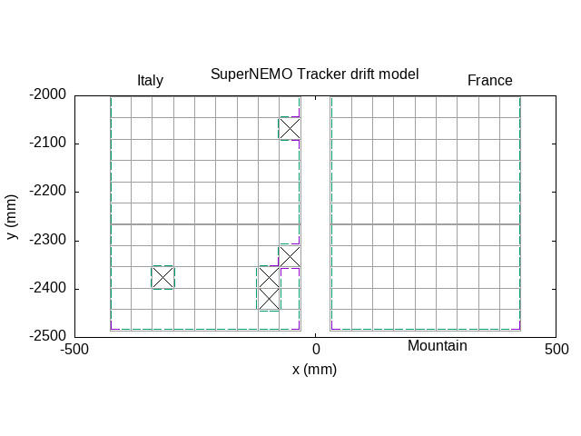
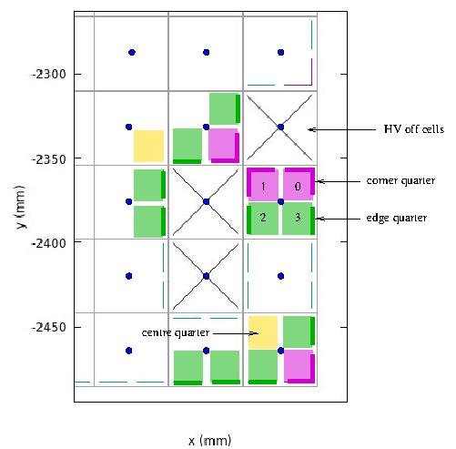

=========================================
SuperNEMO Tracker Drift Model(s)
=========================================

References

 * SuperNEMO Drift Model, Betsy Landells (DocDB 5839)

The "**betsy**" tracker drift model
====================================

Source code :

* ``falaise/snemo/physics_model/tracker_drift_model.hpp``
* ``falaise/snemo/physics_model/tracker_drift_model.cpp``

Class ``snemo::physics_model::tracker_drift_model`` :

- provide a simplified description of the electric field configuration within
  a Geiger cell operating in geiger mode.
- at any given time, a cell can have its HV **on** or **off**.
- each cell is divided in 4 quarters/regions around the central anode wire.
- at any given time, each quarter operates a specific electric field regime which depends on its position in the geometry
  and on the HVs applied at the closest neighbour cells.
- a given electric field regime is associated to some specific modelling of the relation between the
  radial distance to the central wire and the horizontal drift time of the Geiger avalanche.
  

The figure below illustrates the description of a part of the detector.

- black crosses correspond to cell with HV off
- other cells have HV on
- green segments show cell quarters of the *edge* category 
- red segments show cell quarters of the *corner* category
- cell quarters with no decoration are of the *centre* category 

  

	   
..

Details around some cells with HV off: The cell electric field 

	   
..
   
.. end

   
  
   

