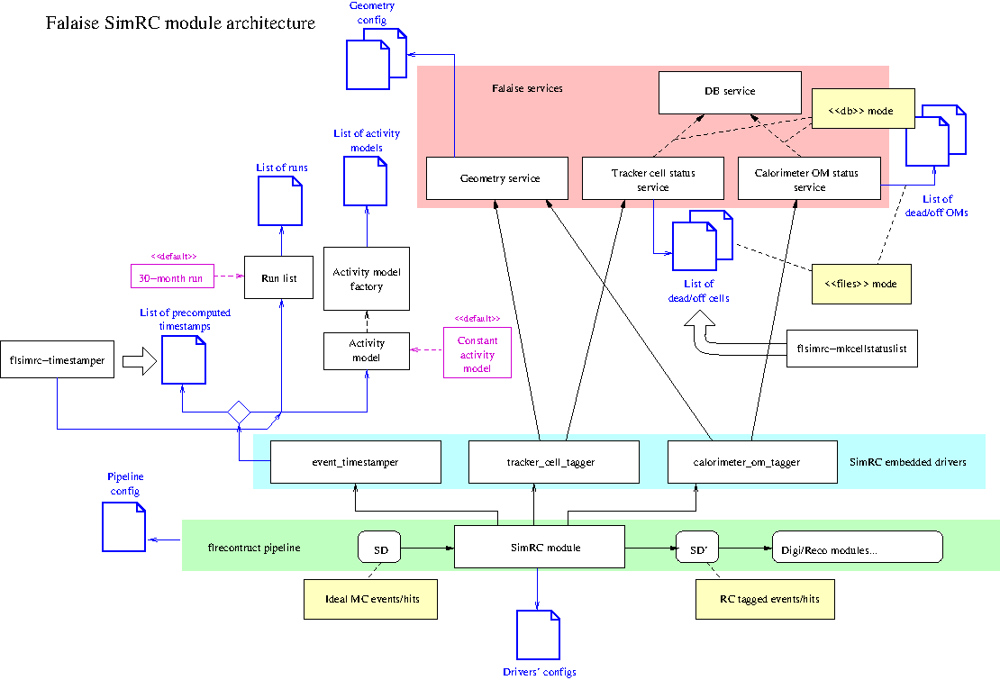

========================================================
SimRC - Simulated Running Conditions
========================================================

:authors: F.Mauger
:date: 2022-06-09

The  SimRC (*Simulated Running  Conditions*)  module allows  to apply  realistic
running  conditions  to idealized  simulated  events  produced by  the
``flsimulate'' program. It consists in  the first processing module to
be  applied to  simulated events before digitization,  calibration and
reconstruction modules.

SimRC  is  based  on  several  fundamental  actions  embedded  in  the
following drivers:

- **event timestamping**  : each simulated  event is associated  to an
  unique timestamp distributed along running periods (using a specific
  list of  runs) with respect  to a specific activity  distribution of
  the  simulated decays  (by  default, we  use  a *constant  activity*
  model).
  
  - It is possible to  select a list of runs described in a file.
    By default, this driver uses a single
    default  ideal  30  months run starting on 2023-01-01 at 00:00:00
    (nominal  exposure  for the  SuperNEMO demonstrator experiment)
  - It  is possible  to define  an  *activity model*  with a  changing
    activity  value  depending  on different  running  periods.   This
    feature can  be used for  modeling unstable radon activity  in the
    tracker gas for  example. Several activity models  are provided in
    Falaise (*constant*, *constant  per period*, *exponential decay*),
    more can be implemented.

    If not  specified, a default  constant activity model is  used and
    the decay event  timestamps are sampled as if the  activity of the
    simulated decaying isotope was constant along the selected running
    period.
  
- **tracker cell status  tagging** : the simulated  truth tracker hits
  are tagged with a specific  status that informs if the corresponding
  cell is dead, off, has no anode or cathode signal(s)...  This status
  depends on  the current running  period the event  timestamp belongs
  to. A dedicated  service (``snemo::tracker_cell_status_service'') is
  responsible of  the accouting of tracker  cells status. It can  use a
  local file  as well as  a database  access to implement  the tracker
  cell status timetable.
- **calorimeter OM status tagging**  : the simulated truth calorimeter
  hits  (main wall,  X-calon gamma  veto) are  tagged with  a specific
  status that  informs if the  corresponding OM is dead,  off...  This
  status depends  on the  current running  period the  event timestamp
  belongs          to.           A          dedicated          service
  (``snemo::calorimeter_om_status_service'')  is  responsible  of  the
  accouting  of OMs  status. It  can use  a local  file as  well as  a
  database access to implement the calorimeter OM status timetable.
       
The SimRC modules uses several new classes implemented in Falaise:

* ``falaise/snemo/physics_model/`` for activity models classes
* ``falaise/snemo/rc/`` for run and  run list definition, tracker cell
  and OM status, event timestamps distributions...
* ``falaise/snemo/services/``  for high  level  services (for  tracker
  cell status, OM status...)

Usage
=====

The SimRC module  can be used within a  ``flreconstruct'' pipeline for
simulated data.  It  must be placed at the first  position of the list
of modules because it aims to tag the SD bank in each simulated event.

The SimRC plugin must be loaded from the ``flreconstruct'' configuration script:

.. code::

   ###########################################################
   [name="flreconstruct.plugins" type="flreconstruct::section"]
   plugins : string[1] = \
     "Falaise_SimRC"
..

Then the pipeline is setup with a front ``SimRC'' module:

.. code::

   ##########################################
   [name="pipeline" type="dpp::chain_module"]
   # The reconstruction pipeline must start with the SimRC module, possibly followed by
   # usual reconstruction modules
   modules : string[5] = "SimRC" 
     "MockCalibration" \
     "CATTrackerClusterizer" \
     "TrackFit" \
     "ChargedParticleTracker" 
..

The SimRC module itself must be configured with a dedicated section.

**Example 1:**

The following  example considers a default  unique ideal run of  2.5 y
long with a constant activity model:

.. code::

   #####################################################
   [name="SimRC" type="snemo::simulation::simrc_module"]
   # Activate timestamping of MC events
   timestamp_event : boolean = true
     # Number of input SD records to be processed (must match the SD input files)
     event_timestamper.number_of_events : integer = 100000
     
   # Activate the tagging of tracker cells' status
   tag_tracker_cell   : boolean = true

   # Activate the tagging of optical modules' status
   tag_calorimeter_om : boolean = true
..

**Example  2:**

The  following example  considers a  distribution of  10000 timestamps
which has been precomputed through the ``flsimrc-timestamper`` program
(see next section) using a specific activity model and a given list of
runs. The  input file  containing 1000000  simulated events,  we reuse
each sampled  timestamp in the  file and  assign it to  100 successive
events.

.. code::

   #####################################################
   [name="SimRC" type="snemo::simulation::simrc_module"]
   # Activate timestamping of MC events
   timestamp_event : boolean = true
     # List of precomputed timestamps
     event_timestamper.mc_event_timestamps_file : string as path = "mc_event_timestamps.lis"
     # Number of input SD records to be processed (must match the SD input files)
     event_timestamper.number_of_events : integer = 1000000
     event_timestamper.timestamp_reuse_factor : integer = 100
   # Activate the tagging of tracker cells' status
   tag_tracker_cell   : boolean = true

   # Activate the tagging of optical modules' status
   tag_calorimeter_om : boolean = true
..

The ``SimRC'' module makes use of the  ``snemo::tracker_cell_status_service``
and ``snemo::calorimeter_om_status_service'' services. Both must be configured
from a dedicated section:

.. code::

   #############################################################
   [name="flreconstruct.services" type="flreconstruct::section"]
   config : string = "services.conf"
..

where ``service.conf'' typically contains:

.. code::
   
   services.configuration_files : string[3] as path = \
     "@falaise:snemo/demonstrator/geometry/GeometryService.conf" \
     "tracker_cell_status_service.conf" \
     "calorimeter_om_status_service.conf"
..

with ``tracker_cell_status_service.conf`` service config file:

.. code::

   [name="trackerCellStatus" type="snemo::tracker_cell_status_service"]
   geometry_label  : string = "geometry"
   mode            : string = "files"
   files.cell_maps : string[2] as path = "dead_cell_map.csv" "off_cell_map.csv"
..

and ``calorimeter_om_status_service.conf`` :

.. code::

   [name="calorimeterOmStatus" type="snemo::calorimeter_om_status_service"]
   geometry_label : string = "geometry"
   mode           : string = "files"
   files.om_maps  : string[2] as path = "dead_om_map.csv" "off_om_map.csv"
..

The ``flsimrc-timestamper`` program
====================================

The ``flsimrc-timestamper`` program aims to compute an ordered list of
timestamps   to  be   assigned  to   simulated  events   generated  by
``flsimulate``.

**Example** : Generate 100000 timestamps distributed along the timeline
of a 2.5 y long ideal run using a constant activity model.

.. code:: shell

   $ flsimrc-timestamper \
      --number-of-events=100000 \
      --timestamp-generation-mode="regular" \
      --event-timestamps-file="mc_event_timestamps.data" 
..

The generated file use the following format :

.. code::

   !falaise::simrc::mc-event-timestamps
   100000
   0 0 2023-01-01 00:06:33.984000
   1 0 2023-01-01 00:19:41.952000
   2 0 2023-01-01 00:32:49.920000
   3 0 2023-01-01 00:45:57.888000
   ...
   99999 0 2025-06-30 23:53:26.016000
..

* First line is a magic token used by a dedicated parser class provided by Falaise
* Second line gives the number of timestamps
* Next lines correspond to an event:

  - First token : event number
  - Second token : run number
  - Final token : event timestamp

The generated file can then be loaded by the ``snemo::tracker_cell_status_service`` class
in ``files'' mode and used in the SimRC module for ``SD'' data.

    
More options are available, see the online help ``flsimrc-timestamper --help''.

Architecture and workflow of the module
===========================================

      
.. end
   
