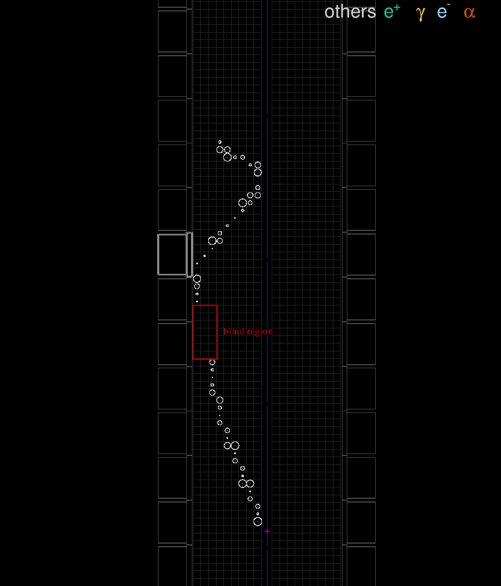
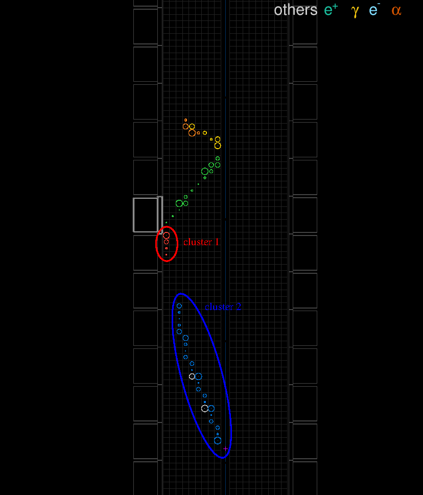

===================================================================
The Falaise SimRC module and tracker cell status tagging
===================================================================

:author: F.Mauger
:date: 2022-05-31

The SimRC  module aims to  emulate realistic running  conditions while
processing the  SuperNEMO simulated data. The  module operates several
actions on Monte Carlo data produced by ``flsimulate``:

#. The first action consists in the assignement of a *timestamp* and a
   *run  ID*  for  each  simulated  event  in  its  *event  header*  bank
   (``"EH"``).  This *event timestamper* driver requires two hypotheses:

   * a  list  of  runs  representing the  considered  period  of  data
     collection (default: an unique mock run of 30 months)
   * a  time  distribution  model  for simulated  decays  (default:  a
     constant activity model during the run)

   The  *event_header* bank  then contains  a *MC  run ID*  and a  *MC
   timestamp* attributes.

     
#. The second optional action  (*tracker cell tagger* driver) consists
   in the tagging  of tracker truth hits in the  *simulated data* bank
   (``"SD"``)         with         a        specific         auxiliary
   property:``"snemo.rc.tracker_cell_status"``.

#. Similarly  the  third  optional  action  (*calorimeter  OM  tagger*
   driver) consists  in the  tagging of  calorimeter truth  hits in the
   ``"SD"``    bank    with    a    specific    auxiliary    property:
   ``"snemo.rc.calorimeter_om_status"``.

Configuration of the test
=====================================

The present test illustrates the effect of the SimRC module on 
track reconstruction.

#. Geometry: basic flat source layout, no magnetic field 
#. Simulation:

   * Se-82 2b0nu events (``"Se82.2nubb"``) from the source bulk (``"source_pads_bulk"``)
   * Some tracker cells are arbitrarily tagged as dead
     (example: side=0, layers=6-8, row=34-40)  
   * The SimRC module is processed along the pipeline
     just before the mock calibration process.

#. SimRC module with 3 steps:

   #. Tag event with a decay time from a constant activity model
      using an unique 30-months long run
   #. Tag all tracker hits with a special status associated to
      tracker cells (dead, off, no_anode...)
   #. Tag all calorimeter hits with a special status associated to
      optical modules (dead, off)

#. Reconstruction pipeline:

   #. Mock calibration for tracker and calorimeter hits
   #. Tracker hits clustering
   #. Track fitting
   #. Charged particle tracker (possibly  with vertex extrapolation on
      foil and associated OM)
   
..

..

This note illustrates the impact of the SimRC module on the
track reconstruction.
   
      
.. raw:: pdf

   PageBreak

Output of the simulation (EH and SD banks) :
=======================================================

Here  all  generated  tracker  truth  hits are  shown.  Some  of  them
(highlighted in yellow) have a too large drift radius (larger than the
cell radius = 22 mm) and are  expected to be discarded during the mock
digitization process).

..

.. raw:: pdf

   PageBreak
   
	   
Output of the SimRC module (modified EH and SD banks) :
============================================================

Some truth hits with large drift radius have been removed as expected,
but some others are removed because the corresponding cells are tagged
as *dead* (in  the red rectangle). No calibrated  hits (white circles)
are  built  from the  truth  hits  in  this  region. This  breaks  the
continuity of the original electron track.

..

.. raw:: pdf

   PageBreak

	   
Output of the mock calibration module (CD bank):
====================================================================

This has a consequence of observing a hole in the expected sequence of
calibrated hits due to dead cells along the electron track.

..

.. raw:: pdf

   PageBreak

 
	   
Output of the tracker clusterizer module (TCD bank):
====================================================================

The electron track in the lower part of the tracker is now splitted in
two independant clusters  of hits (red and blue).

..

.. raw:: pdf

   PageBreak

	   
Output of the tracking module (TTD bank):
====================================================================

Finally  the  tracking  algorithm  fails  to  reconstruct  the  unique
electron  trajectory in  the  lower  part of  the  tracker  and add  an
artifact short track (in red).

.. image:: images/img_5_simrc_ttd.png
   :width: 100%

..

.. raw:: pdf

   PageBreak

This can  be compared with  the result  of the reconstruction  when no
downgraded running conditions are used :  as expected in this case, we
obtain a single cluster (blue) from which we can reconstruct a single track.
 

..

.. end

   
