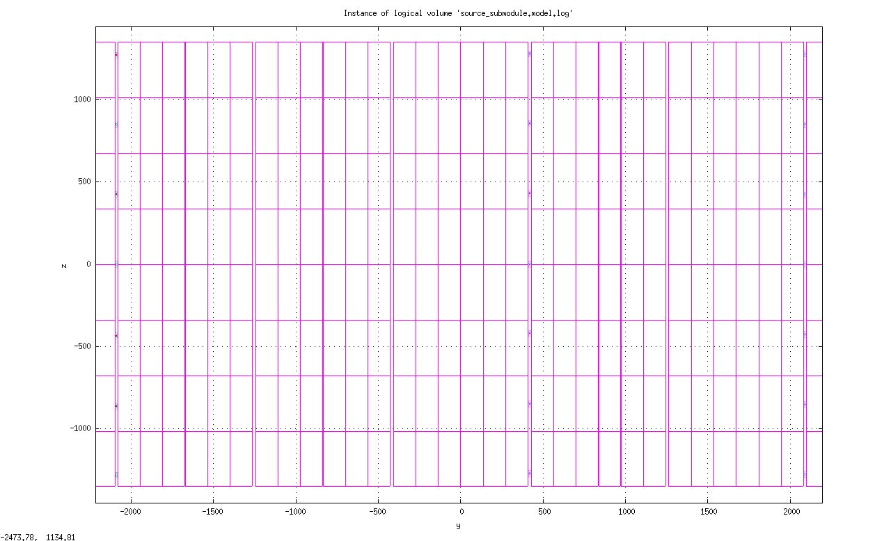
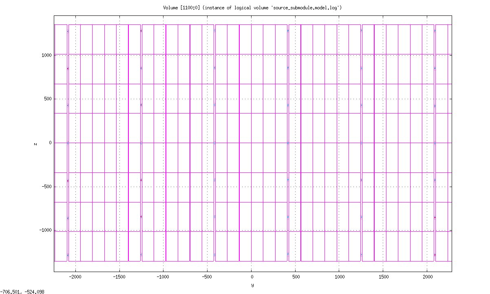
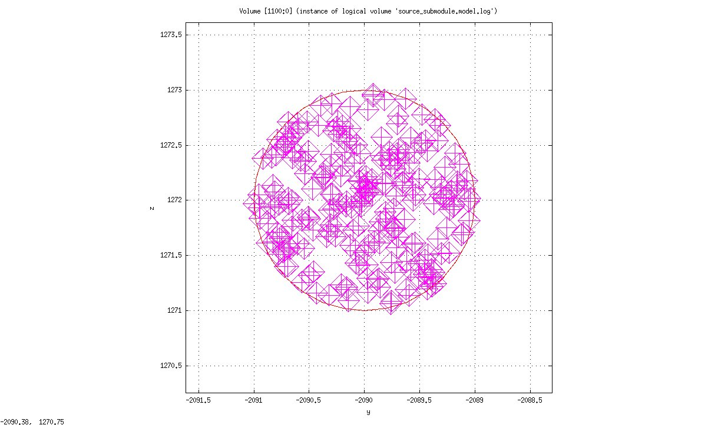

===============================================
Testing solution to Falaise issue #237
===============================================

:author: F.Mauger
:date: 2021-09-20
       
Geometry setup
==============

Configuration updates
---------------------

* Modifications of the variant system in :

   - ``resources/snemo/demonstrator/geometry/variants/``

* Modifications of the geometry model in :

   - ``resources/snemo/demonstrator/geometry/GeometryModels/source_module/source_calibration.geom``

Tests
-----
  
#. Setup Falaise
#. Cd in the Falaise source directory
#. Configure a variant simulation setup using the legacy Bi207 calibration setup (all Bi207 tracks):

   .. code:: shell
	     
      $ flsimulate-configure -o utilities/geometry/test-issue237/snemo_geom_test_legacy_bi207.conf
      $ cat utilities/geometry/test-issue237/snemo_geom_test_legacy_bi207.conf
      ...
   ..
   
#. Configure a variant simulation setup using a specific combinaison of SDS calibration sources (tracks 0, 3 and 5):

   .. code:: shell
	     
      $ flsimulate-configure -o utilities/geometry/test-issue237/snemo_geom_test_sds.conf
      $ cat utilities/geometry/test-issue237/snemo_geom_test_sds.conf
      ...
   ..
   
#. Display the geometry using the legacy Bi207 variant setup:

   .. code:: shell

      $ falaiseInstallDir="/opt/sw/Falaise/install/develop"
      $ falaiseVersion="4.0.3"
      $ bxgeomtools_inspector \
          --logging "debug" \
	  --datatools::resource-path "falaise@${falaiseInstallDir}/share/Falaise-${falaiseVersion}/resources" \
	  --load-dll "Falaise@${falaiseInstallDir}/lib" \
	  --variant-config "@falaise:snemo/demonstrator/geometry/GeometryVariantRepository.conf" \
	  --variant-load "utilities/geometry/test-issue237/snemo_geom_test_legacy_bi207.conf" \
	  --manager-config "@falaise:snemo/demonstrator/geometry/GeometryManager.conf" 
      geomtools> display source_submodule.model.log
      geomtools> display source_calibration_track_5.model.log
      geomtools> quit
   ..

.. raw:: pdf
   
   PageBreak
..

   Activation of the legacy Bi207 calibration source model (all tracks):
   
   .. image:: check_bi207_legacy_selection_1.jpeg
      :width: 100%

.. raw:: pdf
   
   PageBreak
..

   
#. Display the geometry using the SDS variant setup with selection of tracks 0, 3 and 5:

   .. code:: shell

      $ falaiseInstallDir="/opt/sw/Falaise/install/develop"
      $ falaiseVersion="4.0.3"
      $ bxgeomtools_inspector \
          --logging "debug" \
	  --datatools::resource-path "falaise@${falaiseInstallDir}/share/Falaise-${falaiseVersion}/resources" \
	  --load-dll "Falaise@${falaiseInstallDir}/lib" \
	  --variant-config "@falaise:snemo/demonstrator/geometry/GeometryVariantRepository.conf" \
	  --variant-load "utilities/geometry/test-issue237/snemo_geom_test_sds.conf" \
	  --manager-config "@falaise:snemo/demonstrator/geometry/GeometryManager.conf" 
      geomtools> display source_submodule.model.log
      geomtools> display source_calibration_track_5.model.log
      geomtools> quit
   ..

Activation of the SDS calibration source model (specific selection of tracks: 0,3 and 5):
 

..
   
.. .. image:: check_sds_selection_2.jpeg
.. :width: 90%
..
   
.. raw:: pdf

   PageBreak
..		       
	      
Vertex generator setup
======================

Configuration updates
---------------------

* Modifications of the variant system in :

   - ``resources/snemo/demonstrator/geometry/variants/vertex/``
     
* Modifications of the geometry model in :

   - ``resources/snemo/demonstrator/geometry/VertexModels/source_module/source_calibration.geom``

Tests
-----

#. Configure a variant simulation setup using the legacy Bi207 calibration setup (all Bi207 tracks):

   .. code:: shell
	     
      $ flsimulate-configure -o utilities/geometry/test-issue237/snemo_geom_test_legacy_bi207.conf
      $ cat utilities/geometry/test-issue237/snemo_geom_test_legacy_bi207.conf
      ...
   ..
   
#. Display the geometry using the legacy Bi207 variant setup:

   .. code:: shell
	     
      $ falaiseInstallDir="/opt/sw/Falaise/install/develop"
      $ falaiseVersion="4.0.3"
      $ bxgenvtx_production \
          --logging "debug" \
	  --datatools::resource-path "falaise@${falaiseInstallDir}/share/Falaise-${falaiseVersion}/resources" \
	  --load-dll "Falaise@${falaiseInstallDir}/lib" \
	  --variant-config "@falaise:snemo/demonstrator/geometry/VertexGeneratorVariantRepository.conf" \
	  --variant-load "utilities/geometry/test-issue237/snemo_geom_test_legacy_bi207.conf" \
	  --geometry-manager "@falaise:snemo/demonstrator/geometry/GeometryManager.conf" \
          --vertex-generator-manager "@falaise:snemo/demonstrator/geometry/VertexGeneratorManager.conf" \
 	  --vertex-generator "source_calibration_all_spots" \
          --shoot \
          --prng-seed 314159 \
          --number-of-vertices 10000 \
          --output-file "vertices_legacy_bi207.data" \
	  --visu-spot-size "0.1 mm" \
	  --visu-output-file "vertices_legacy_bi207-visu-dd.data.gz"
      $ gnuplot
      gnuplot> splot 'vertices.data'
      gnuplot> set xrange [-1000:+1000]
      gnuplot> set yrange [-2500:+2500]
      gnuplot> set zrange [-1500:+1500]
      gnuplot> splot 'vertices.data'
      gnuplot> quit
      $ bxgeomtools_inspector \
          --logging "debug" \
	  --datatools::resource-path "falaise@${falaiseInstallDir}/share/Falaise-${falaiseVersion}/resources" \
	  --load-dll "Falaise@${falaiseInstallDir}/lib" \
	  --variant-config "@falaise:snemo/demonstrator/geometry/GeometryVariantRepository.conf" \
	  --variant-load "utilities/geometry/test-issue237/snemo_geom_test_legacy_bi207.conf" \
	  --manager-config "@falaise:snemo/demonstrator/geometry/GeometryManager.conf"
      geomtools> load_display_data "vertices" "vertices_legacy_bi207-visu-dd.data.gz"
      geomtools> d -yz [1100:0]
   ..

.. raw:: pdf
	 
   PageBreak
..
   
Generation of the legacy Bi207 calibration source model (vertexes on all 42 Bi207 sources, 6 tracks):
   

..

Detail of the vertexes generated from a specific source spot:

..
   
.. raw:: pdf

   PageBreak
..
  
#. Display the geometry using the SDS variant setup:

   .. code:: shell
	     
      $ falaiseInstallDir="/opt/sw/Falaise/install/develop"
      $ falaiseVersion="4.0.3"
      $ bxgenvtx_production \
          --logging "debug" \
	  --datatools::resource-path "falaise@${falaiseInstallDir}/share/Falaise-${falaiseVersion}/resources" \
	  --load-dll "Falaise@${falaiseInstallDir}/lib" \
	  --variant-config "@falaise:snemo/demonstrator/geometry/VertexGeneratorVariantRepository.conf" \
	  --variant-load "utilities/geometry/test-issue237/snemo_geom_test_sds.conf" \
	  --geometry-manager "@falaise:snemo/demonstrator/geometry/GeometryManager.conf" \
          --vertex-generator-manager "@falaise:snemo/demonstrator/geometry/VertexGeneratorManager.conf" \
 	  --vertex-generator "sds_bi207_calibration_source_all_tracks" \
          --shoot \
          --prng-seed 314159 \
          --number-of-vertices 10000 \
          --output-file "vertices_sds.data" \
	  --visu-spot-size "0.1 mm" \
	  --visu-output-file "vertices_sds-visu-dd.data.gz"
      $ gnuplot
      gnuplot> set xrange [-1000:+1000]
      gnuplot> set yrange [-2500:+2500]
      gnuplot> set zrange [-1500:+1500]
      gnuplot> splot 'vertices.data'
      gnuplot> quit
      $ bxgeomtools_inspector \
          --logging "debug" \
	  --datatools::resource-path "falaise@${falaiseInstallDir}/share/Falaise-${falaiseVersion}/resources" \
	  --load-dll "Falaise@${falaiseInstallDir}/lib" \
	  --variant-config "@falaise:snemo/demonstrator/geometry/GeometryVariantRepository.conf" \
	  --variant-load "utilities/geometry/test-issue237/snemo_geom_test_sds.conf" \
	  --manager-config "@falaise:snemo/demonstrator/geometry/GeometryManager.conf"
      geomtools> load_display_data "vertices" "vertices_sds-visu-dd.data.gz"
      geomtools> d -yz [1100:0]
   ..

Generation of the SDS calibration source model (vertexes only on sources in track 0, 3 and 5):

* Vertexes generated only on tracks 0 (right), 3 and 5 (3D view restricted to a given horizontal position):
  
  .. image:: check_sds_vertexes_2.jpg
     :width: 75%
  ..
   
* Detail on track 0, last top source (position=6):
   
  .. image:: check_sds_vertexes_1.jpg
     :width: 70%
  ..
	      
Vertex generator setup
======================

.. end
